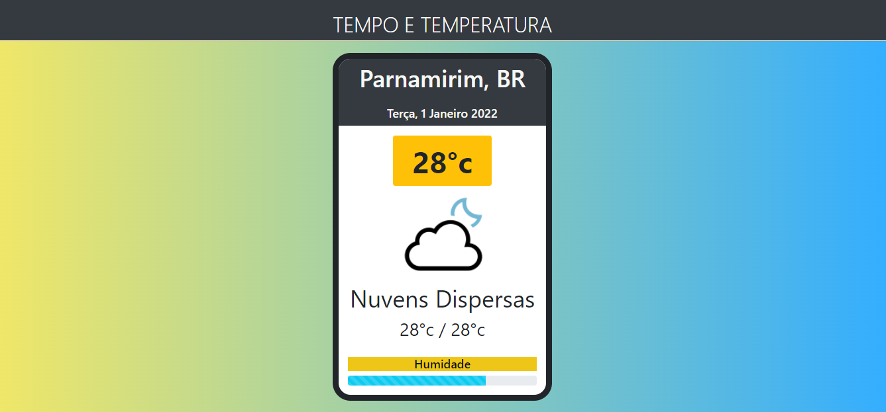

# ClimaAtual

## Clima Atual criado em React.js e consumindo api externa openweathermap.

🚀 https://openweathermap.org/api

<h1 align="center">
    <a href="https://atualclima.netlify.app/">🔗 Atual Clima</a>
    
</h1>

🚀 Front-end em bootstrap

🚀 Api openweathermap
